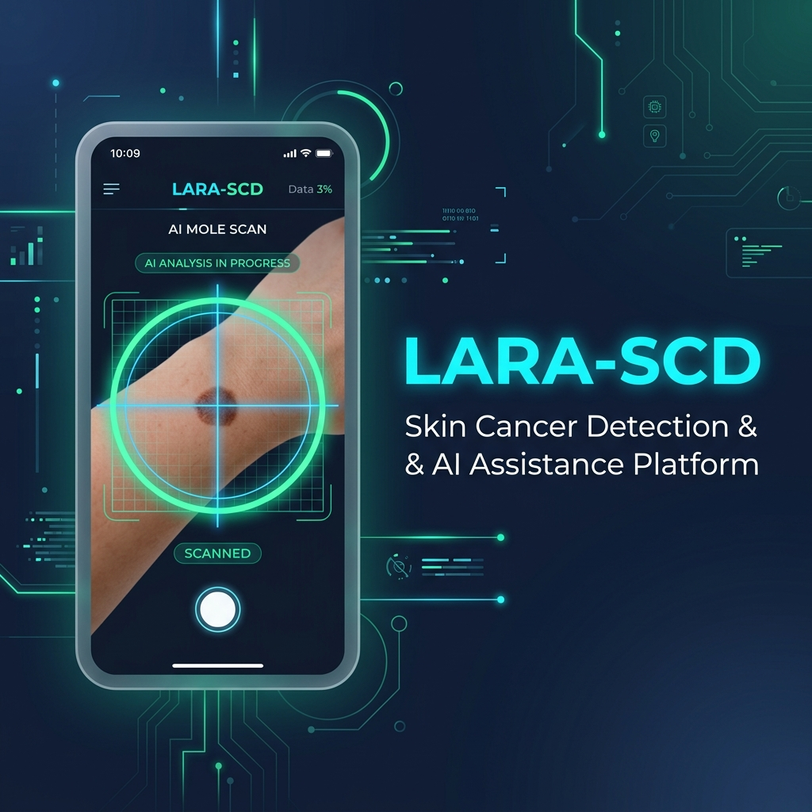

# 📚 LARA-SCD — Documentação dos Serviços



**SCD (Skin Cancer Detection)** — Sistema de detecção de câncer de pele com inteligência artificial.

---

## 📖 Índice

| Documento | Descrição |
|---|---|
| [Visão Geral da Arquitetura](./arquitetura.md) | Arquitetura geral do sistema, microsserviços e stack tecnológica |
| [API Backend (Spring Boot)](./servico-backend.md) | Documentação completa da API REST do backend Java |
| [API de IA (FastAPI)](./servico-ia.md) | Documentação do microsserviço de predição com IA (Python) |
| [App Mobile (React Native/Expo)](./servico-mobile.md) | Documentação dos serviços do app mobile |
| [Segurança e Autenticação](./seguranca.md) | JWT, roles, regras de acesso e CORS |
| [Infraestrutura e Deploy](./infraestrutura.md) | Docker, Docker Compose e configurações de ambiente |

---

## ⚡ Início Rápido

```bash
# 1. Subir o backend (Spring Boot + MySQL)
cd scd
docker-compose up -d

# 2. Subir o serviço de IA (FastAPI)
cd api-scd
docker-compose up -d

# 3. Subir o app mobile (Expo)
cd scd-mobile
npm install
npx expo start
```

### Usuários padrão (perfil `prod`)

| Tipo | Email | Senha |
|---|---|---|
| Médico | `doctor@example.com` | `password123` |
| Gerente | `manager@example.com` | `password123` |
