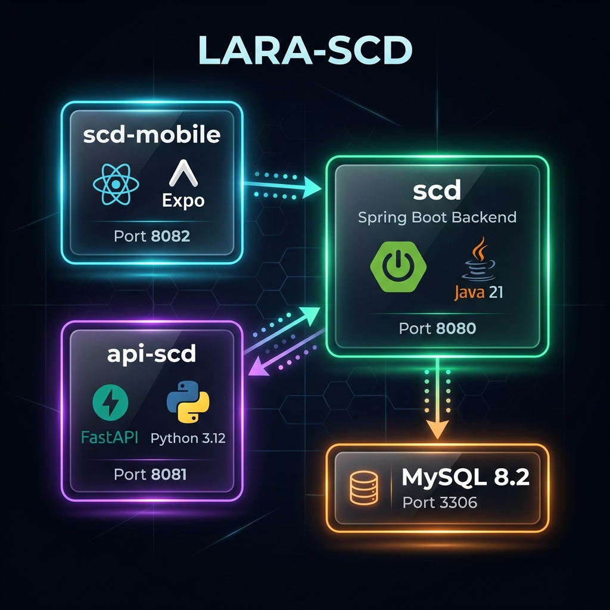
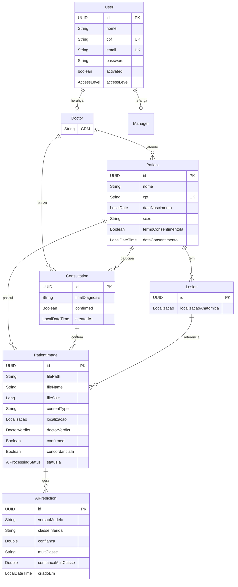

# 🏗️ Arquitetura do Sistema LARA-SCD

## Visão Geral

O LARA-SCD é uma plataforma de detecção de câncer de pele assistida por IA, composta por **3 microsserviços** que se comunicam para fornecer diagnósticos dermatológicos.



---

## Componentes

### 1. `scd` — Backend Principal (Spring Boot)

| Aspecto | Detalhe |
|---|---|
| **Linguagem** | Java 21 |
| **Framework** | Spring Boot 3.5.7 |
| **Porta** | 8080 |
| **Banco de Dados** | MySQL 8.2 (produção) / H2 (desenvolvimento) |
| **Autenticação** | JWT (Auth0 java-jwt 4.4.0) |
| **Documentação API** | Swagger/OpenAPI (springdoc 2.8.5) |
| **ORM** | Spring Data JPA + Hibernate + Envers |

**Responsabilidades:**
- Autenticação e autorização de usuários (médicos e gerentes)
- CRUD de pacientes, consultas e imagens
- Orquestração de chamadas ao serviço de IA
- Armazenamento de arquivos (imagens de lesões)
- Geração de backups (dataset ZIP com CSV de metadados)
- Dashboard administrativo

---

### 2. `api-scd` — Microsserviço de IA (FastAPI)

| Aspecto | Detalhe |
|---|---|
| **Linguagem** | Python 3.12 |
| **Framework** | FastAPI + Uvicorn |
| **Porta** | 8081 |
| **Modelo IA** | YOLOv8 (simulado — `YOLOv8_simulated_v1.0`) |
| **Bibliotecas** | Pillow, NumPy, Pydantic |

**Responsabilidades:**
- Receber imagens de lesões de pele + metadados (idade, sexo, localização)
- Realizar classificação binária: `benigno` / `maligno`
- Realizar sub-classificação multiclasse:
  - Benigno: `nv`, `bkl`, `df`, `vasc`
  - Maligno: `mel`, `bcc`, `akiec`
- Retornar predições com probabilidades

> ⚠️ **Nota:** Atualmente os modelos YOLOv8 estão **simulados** (valores hardcoded). No futuro, serão substituídos pelos modelos reais treinados.

---

### 3. `scd-mobile` — Aplicativo Móvel (React Native / Expo)

| Aspecto | Detalhe |
|---|---|
| **Framework** | React Native 0.81.5 + Expo SDK 54 |
| **Navegação** | Expo Router 6 |
| **HTTP Client** | Axios 1.13.6 |
| **Armazenamento Local** | AsyncStorage |
| **Linguagem** | TypeScript 5.9.2 |

**Responsabilidades:**
- Interface do médico para login e registro
- Cadastro de pacientes (com consentimento LGPD)
- Criação de consultas com upload de múltiplas imagens
- Visualização de resultados da IA
- Confirmação de diagnóstico pelo médico
- Painel administrativo (dashboard, backup, alteração de senha)

---

## Fluxo Principal de Dados

```
1. Médico faz login no app mobile
        │
        ▼
2. Cadastra paciente (com consentimento LGPD)
        │
        ▼
3. Cria consulta com imagens de lesões
        │
        ▼
4. Backend recebe imagens e para cada uma:
   a. Salva o arquivo no disco
   b. Cria registro PatientImage (status: PENDENTE)
   c. Chama o serviço de IA (api-scd)
   d. Recebe predição (benigno/maligno + sub-classe)
   e. Salva AiPrediction e atualiza status (CONCLUIDO/FALHA)
        │
        ▼
5. Médico revisa cada imagem e confirma/altera o diagnóstico
   (calcula concordância com a IA)
        │
        ▼
6. Gerente pode exportar dataset (imagens + CSV) para treino
```

---

## Modelo de Dados (Entidades Principais)



### Relacionamentos

| De | Para | Cardinalidade | Descrição |
|---|---|---|---|
| `User` | `Doctor` | 1:1 | Herança — Médico estende User (`AccessLevel.DOCTOR`) |
| `User` | `Manager` | 1:1 | Herança — Gerente estende User (`AccessLevel.MANAGER`) |
| `Doctor` | `Patient` | 1:N | Um médico atende vários pacientes |
| `Doctor` | `Consultation` | 1:N | Um médico realiza várias consultas |
| `Patient` | `Consultation` | 1:N | Um paciente pode ter várias consultas |
| `Patient` | `PatientImage` | 1:N | Um paciente possui várias imagens |
| `Patient` | `Lesion` | 1:N | Um paciente pode ter várias lesões |
| `Consultation` | `PatientImage` | 1:N | Uma consulta contém várias imagens (máx. 20) |
| `Lesion` | `PatientImage` | 1:N | Uma lesão pode ter várias imagens ao longo do tempo |
| `PatientImage` | `AiPrediction` | 1:N | Uma imagem pode ter múltiplas predições (versionadas) |

### Enums

| Enum | Valores | Uso |
|---|---|---|
| `AccessLevel` | `DOCTOR`, `MANAGER` | Nível de acesso do usuário |
| `Localizacao` | `CABECA`, `PESCOCO`, `TRONCO`, `BRACO_DIREITO`, `BRACO_ESQUERDO`, `MAO_DIREITA`, `MAO_ESQUERDA`, `PERNA_DIREITA`, `PERNA_ESQUERDA`, `PE_DIREITO`, `PE_ESQUERDO`, `COSTAS`, `ABDOMEN` | Localização anatômica da lesão |
| `DoctorVerdict` | `AGUARDANDO_BIOPSIA`, `MELANOMA`, `CARCINOMA_BASOCELULAR`, `CARCINOMA_ESPINOCELULAR`, `QUERATOSE_ACTINICA`, `NEVO` | Diagnóstico final do médico |
| `AiProcessingStatus` | `PENDENTE`, `CONCLUIDO`, `FALHA` | Status do processamento pela IA |
| `PredictionClass` | `benigno`, `maligno` | Classificação binária da IA |

---

## Stack Tecnológica Completa

| Camada | Tecnologia | Versão |
|---|---|---|
| **Mobile** | React Native + Expo + TypeScript | RN 0.81.5 / Expo SDK 54 / TS 5.9.2 |
| **Backend** | Spring Boot + Spring Security + Spring Data JPA | Java 21 / Spring Boot 3.5.7 |
| **IA/ML** | FastAPI + YOLOv8 + NumPy + Pillow | Python 3.12 |
| **Banco de Dados** | MySQL (prod) / H2 (dev) | MySQL 8.2 |
| **Autenticação** | JWT (Auth0 java-jwt) + BCrypt | java-jwt 4.4.0 |
| **HTTP Client** | Axios (mobile) / WebClient (backend → IA) | Axios 1.13.6 |
| **Documentação** | SpringDoc OpenAPI + Swagger UI | springdoc 2.8.5 |
| **Containerização** | Docker + Docker Compose | — |
| **Auditoria** | Spring Data Envers | — |
| **Validação** | Spring Validation (backend) / Pydantic (IA) | — |

