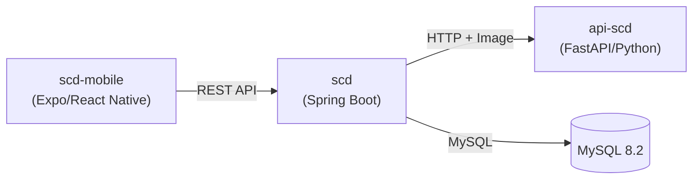
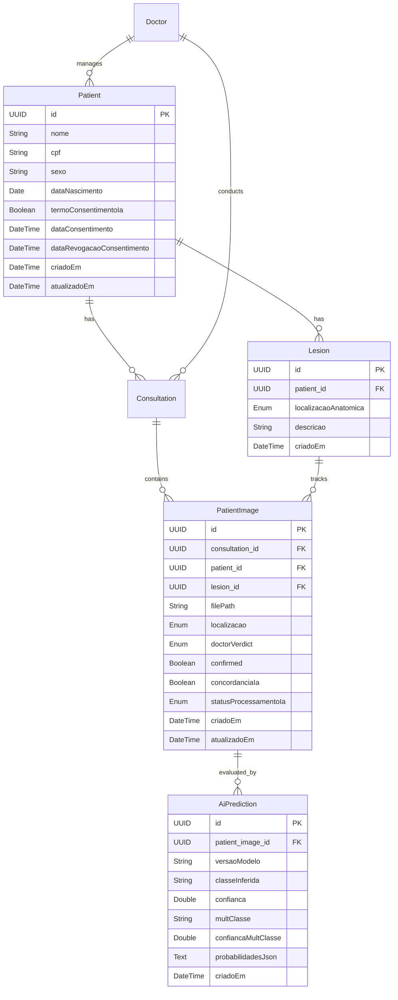
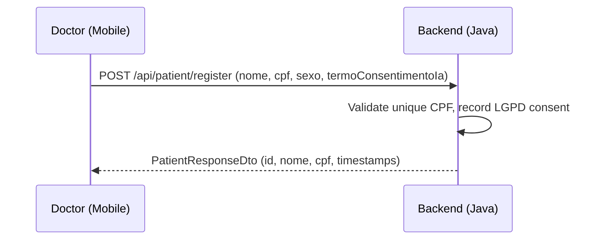
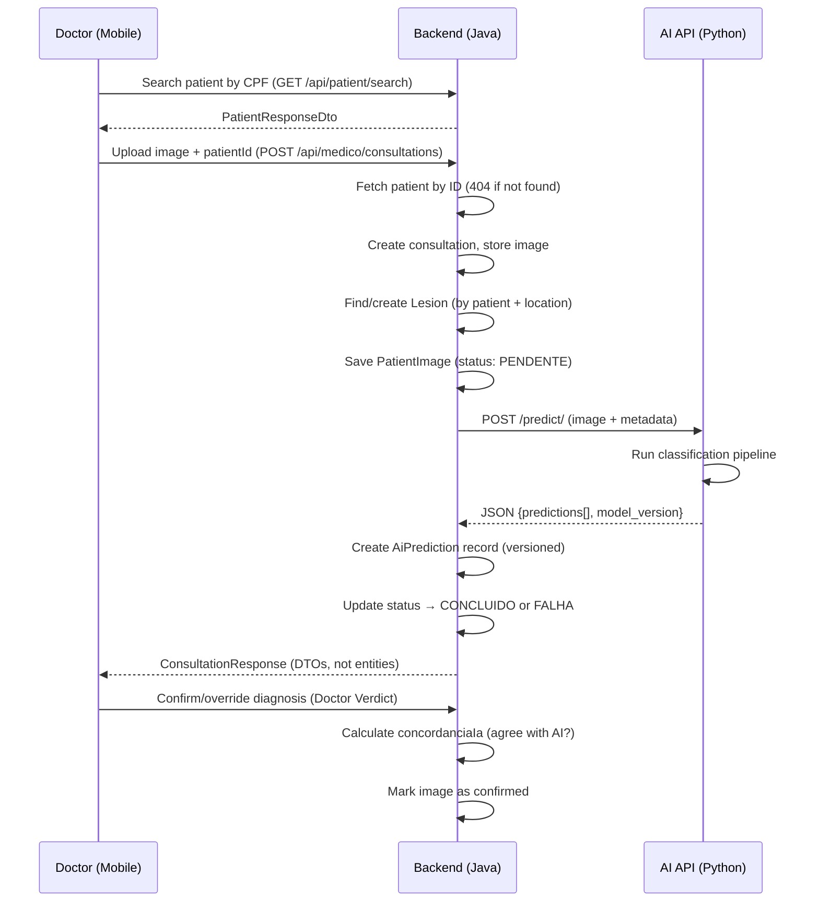

# LARA-SCD — Project Walkthrough

## Overview

**LARA-SCD (Skin Cancer Detection)** is a clinical decision support system that uses AI-powered image classification to assist dermatologists in diagnosing skin lesions. It follows a **Human-in-the-Loop** methodology — AI results are suggestions that must be confirmed by a medical professional.

---

## Architecture

The system is composed of **3 decoupled services**:

| Component | Stack | Port | Purpose |
|---|---|---|---|
| `scd` | Java 21, Spring Boot 3.5.7 | 8080 | Core backend — auth, CRUD, business rules |
| `api-scd` | Python 3.12, FastAPI | 8081 | AI inference — image classification |
| `scd-mobile` | TypeScript, Expo/React Native | — | Mobile client for doctors & admins |

---

## Component Details

### 1. `api-scd` — AI Prediction Service

**Entry point:** [main.py](file:///c:/Users/Jair%20Victor/Documents/LARA-SCD/api-scd/main.py)

- **Framework:** FastAPI + Uvicorn
- **Endpoint:** `POST /predict/` — receives an image + metadata (age, sex, location)
- **Response:** JSON with `predictions[]` and `model_version` (for model traceability)
- **Classification pipeline** (hierarchical, top-down):
  1. **Binary model** → `benigno` or `maligno`
  2. **Multiclass model** → subtype based on binary result:
     - Benign: `nv`, `bkl`, `df`, `vasc`
     - Malignant: `mel`, `bcc`, `akiec`
- **Current state:** Models are **simulated** (hardcoded results). Real YOLO model integration is marked with `TODO` comments.

Key files:
- [controller_predict.py](file:///c:/Users/Jair%20Victor/Documents/LARA-SCD/api-scd/controller/controller_predict.py) — route handler
- [predict.py](file:///c:/Users/Jair%20Victor/Documents/LARA-SCD/api-scd/service/predict.py) — prediction logic (simulated)

---

### 2. `scd` — Java/Spring Boot Backend

**Entry point:** [ScdApplication.java](file:///c:/Users/Jair%20Victor/Documents/LARA-SCD/scd/src/main/java/com/lara/scd/ScdApplication.java)

Organized by **domain modules**, each with `application` (controllers/DTOs) and `domain` (models/repos/services) layers:

| Module | Description |
|---|---|
| `consultation` | Consultation lifecycle (create, list, confirm diagnosis) |
| `doctor` | Doctor registration and management |
| `patient` | Patient CRUD (**decoupled from consultation**), images, verdicts |
| `lesion` | Physical lesion tracking across consultations (temporal evolution) |
| `predict` | AI prediction versioning + proxy to the Python AI API |
| `manager` | Admin/manager operations, dashboard (5 metrics) |
| `user` | Authentication (login, JWT) |
| `shared` | File storage, static file serving |
| `config/security` | JWT filter, Spring Security config |

> [!NOTE]
> **DTOs on all controllers**: No JPA entity is returned directly. Each controller uses record or class DTOs with `from()` factory method. Repositories follow Java convention (no `I` prefix).

**Key dependencies:** Spring Data JPA, Spring Security, JWT (jjwt + java-jwt), WebFlux (for async HTTP to AI API), Lombok, SpringDoc (Swagger), MySQL, H2 (test).

**Infrastructure:** Docker Compose spins up MySQL 8.2 + the Spring Boot app on a shared `redescd` bridge network.

---

#### Database Schema (Entity Relationship)

---

### 3. `scd-mobile` — Mobile Frontend

**Framework:** Expo (React Native) with TypeScript and file-based routing.

| Directory | Contents |
|---|---|
| `app/` | Screens: [login.tsx](file:///c:/Users/Jair%20Victor/Documents/LARA-SCD/scd-mobile/app/login.tsx), [register.tsx](file:///c:/Users/Jair%20Victor/Documents/LARA-SCD/scd-mobile/app/register.tsx), [index.tsx](file:///c:/Users/Jair%20Victor/Documents/LARA-SCD/scd-mobile/app/index.tsx), tabs ([admin.tsx](file:///c:/Users/Jair%20Victor/Documents/LARA-SCD/scd-mobile/app/%28tabs%29/admin.tsx), [medico.tsx](file:///c:/Users/Jair%20Victor/Documents/LARA-SCD/scd-mobile/app/%28tabs%29/medico.tsx)) |
| `services/` | [api.ts](file:///c:/Users/Jair%20Victor/Documents/LARA-SCD/scd-mobile/services/api.ts), [authService.ts](file:///c:/Users/Jair%20Victor/Documents/LARA-SCD/scd-mobile/services/authService.ts), [consultationService.ts](file:///c:/Users/Jair%20Victor/Documents/LARA-SCD/scd-mobile/services/consultationService.ts), **[patientService.ts](file:///c:/Users/Jair%20Victor/Documents/LARA-SCD/scd-mobile/services/patientService.ts)** (decoupled patient CRUD), [adminService.ts](file:///c:/Users/Jair%20Victor/Documents/LARA-SCD/scd-mobile/services/adminService.ts), [predictService.ts](file:///c:/Users/Jair%20Victor/Documents/LARA-SCD/scd-mobile/services/predictService.ts) (deprecated) |
| `contexts/` | [AuthContext.tsx](file:///c:/Users/Jair%20Victor/Documents/LARA-SCD/scd-mobile/contexts/AuthContext.tsx) — authentication state and role-based navigation |
| `components/` | Reusable UI components |
| `constants/` | Theme configuration |

---

## Data Flow

### Patient Registration (decoupled from consultation)

### Skin Lesion Diagnosis

---

## Key Observations

> [!IMPORTANT]
> The AI models are currently **simulated** — [predict.py](file:///c:/Users/Jair%20Victor/Documents/LARA-SCD/api-scd/service/predict.py) returns hardcoded values. Real YOLO model files (`.pt`) need to be trained and placed in a `models/` directory.

> [!NOTE]
> The system uses **two JWT libraries** (`jjwt` + `java-jwt`). Consider consolidating to one.

> [!TIP]
> The [api-scd/requirements.txt](file:///c:/Users/Jair%20Victor/Documents/LARA-SCD/api-scd/requirements.txt) does **not** include `ultralytics` (YOLO). It will need to be added when real models are integrated.

> [!NOTE]
> AI predictions are now **versioned** in the `ai_predictions` table. A single image can be re-evaluated by newer models without losing historical data. The `concordancia_ia` field on each image tracks whether the doctor agreed with the AI's binary classification (malignant/benign).

> [!NOTE]
> Patient registration is **decoupled** from consultation creation. The doctor first registers the patient (with LGPD consent), then creates consultations linking by `patientId`.

