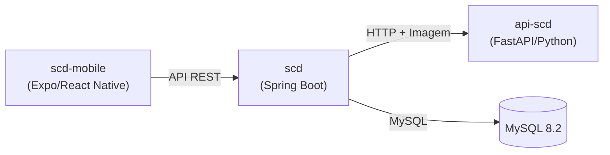
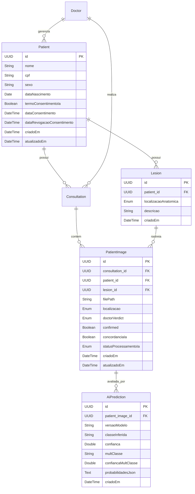
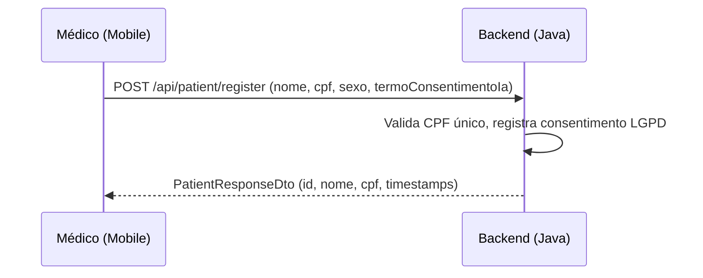
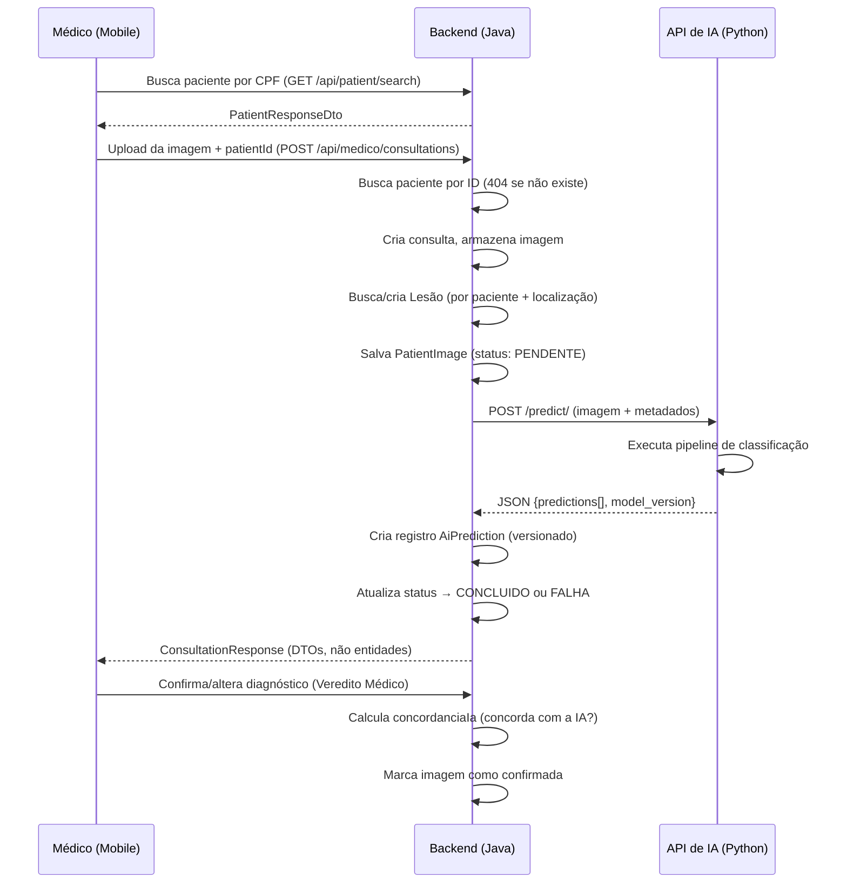

# LARA-SCD — Visão Geral do Projeto

## Resumo

**LARA-SCD (Skin Cancer Detection)** é um sistema de suporte à decisão clínica que utiliza classificação de imagens por IA para auxiliar dermatologistas no diagnóstico de lesões cutâneas. Segue a metodologia **Human-in-the-Loop** — os resultados da IA são sugestões que devem ser confirmadas por um profissional médico.

---

## Arquitetura

O sistema é composto por **3 serviços desacoplados**:

| Componente | Stack | Porta | Função |
|---|---|---|---|
| `scd` | Java 21, Spring Boot 3.5.7 | 8080 | Backend principal — autenticação, CRUD, regras de negócio |
| `api-scd` | Python 3.12, FastAPI | 8081 | Inferência de IA — classificação de imagens |
| `scd-mobile` | TypeScript, Expo/React Native | — | Cliente móvel para médicos e administradores |

---

## Detalhes dos Componentes

### 1. `api-scd` — Serviço de Predição (IA)

**Ponto de entrada:** [main.py](file:///c:/Users/Jair%20Victor/Documents/LARA-SCD/api-scd/main.py)

- **Framework:** FastAPI + Uvicorn
- **Endpoint:** `POST /predict/` — recebe imagem + metadados (idade, sexo, localização)
- **Resposta:** JSON com `predictions[]` e `model_version` (para rastreabilidade do modelo)
- **Pipeline de classificação** (hierárquico, top-down):
  1. **Modelo binário** → `benigno` ou `maligno`
  2. **Modelo multiclasse** → subtipo conforme resultado binário:
     - Benigno: `nv`, `bkl`, `df`, `vasc`
     - Maligno: `mel`, `bcc`, `akiec`
- **Estado atual:** Modelos **simulados** (resultados hardcoded). A integração real com YOLO está marcada com `TODO`.

Arquivos principais:
- [controller_predict.py](file:///c:/Users/Jair%20Victor/Documents/LARA-SCD/api-scd/controller/controller_predict.py) — rota do endpoint
- [predict.py](file:///c:/Users/Jair%20Victor/Documents/LARA-SCD/api-scd/service/predict.py) — lógica de predição (simulada)

---

### 2. `scd` — Backend Java/Spring Boot

**Ponto de entrada:** [ScdApplication.java](file:///c:/Users/Jair%20Victor/Documents/LARA-SCD/scd/src/main/java/com/lara/scd/ScdApplication.java)

Organizado por **módulos de domínio**, cada um com camadas `application` (controllers/DTOs) e `domain` (models/repos/services):

| Módulo | Descrição |
|---|---|
| `consultation` | Ciclo de vida da consulta (criar, listar, confirmar diagnóstico) |
| `doctor` | Cadastro e gerenciamento de médicos |
| `patient` | CRUD de pacientes (**separado da consulta**), imagens, vereditos |
| `lesion` | Rastreamento de lesões físicas ao longo das consultas (evolução temporal) |
| `predict` | Versionamento de predições de IA + proxy para a API Python |
| `manager` | Operações do administrador, dashboard (5 métricas) |
| `user` | Autenticação (login, JWT) |
| `shared` | Armazenamento de arquivos, servir arquivos estáticos |
| `config/security` | Filtro JWT, configuração do Spring Security |

> [!NOTE]
> **DTOs em todos os controllers**: Nenhuma entidade JPA é retornada diretamente. Cada controller usa records ou classes DTO com factory method `from()`. Repositórios seguem convenção Java (sem prefixo `I`).

**Dependências principais:** Spring Data JPA, Spring Security, JWT (jjwt + java-jwt), WebFlux (HTTP assíncrono para a API de IA), Lombok, SpringDoc (Swagger), MySQL, H2 (teste).

**Infraestrutura:** Docker Compose sobe MySQL 8.2 + app Spring Boot em uma rede bridge compartilhada (`redescd`).

---

#### Esquema do Banco de Dados (Relacionamento entre Entidades)

---

### 3. `scd-mobile` — Frontend Móvel

**Framework:** Expo (React Native) com TypeScript e roteamento baseado em arquivos.

| Diretório | Conteúdo |
|---|---|
| `app/` | Telas: [login.tsx](file:///c:/Users/Jair%20Victor/Documents/LARA-SCD/scd-mobile/app/login.tsx), [register.tsx](file:///c:/Users/Jair%20Victor/Documents/LARA-SCD/scd-mobile/app/register.tsx), [index.tsx](file:///c:/Users/Jair%20Victor/Documents/LARA-SCD/scd-mobile/app/index.tsx), tabs ([admin.tsx](file:///c:/Users/Jair%20Victor/Documents/LARA-SCD/scd-mobile/app/%28tabs%29/admin.tsx), [medico.tsx](file:///c:/Users/Jair%20Victor/Documents/LARA-SCD/scd-mobile/app/%28tabs%29/medico.tsx)) |
| `services/` | [api.ts](file:///c:/Users/Jair%20Victor/Documents/LARA-SCD/scd-mobile/services/api.ts), [authService.ts](file:///c:/Users/Jair%20Victor/Documents/LARA-SCD/scd-mobile/services/authService.ts), [consultationService.ts](file:///c:/Users/Jair%20Victor/Documents/LARA-SCD/scd-mobile/services/consultationService.ts), **[patientService.ts](file:///c:/Users/Jair%20Victor/Documents/LARA-SCD/scd-mobile/services/patientService.ts)** (CRUD pacientes separado), [adminService.ts](file:///c:/Users/Jair%20Victor/Documents/LARA-SCD/scd-mobile/services/adminService.ts), [predictService.ts](file:///c:/Users/Jair%20Victor/Documents/LARA-SCD/scd-mobile/services/predictService.ts) (deprecated) |
| `contexts/` | [AuthContext.tsx](file:///c:/Users/Jair%20Victor/Documents/LARA-SCD/scd-mobile/contexts/AuthContext.tsx) — estado de autenticação e navegação por papel |
| `components/` | Componentes reutilizáveis de UI |
| `constants/` | Configuração de tema |

---

## Fluxo de Dados

### Cadastro de Paciente (separado da consulta)

### Diagnóstico de Lesão Cutânea

---

## Observações Importantes

> [!IMPORTANT]
> Os modelos de IA estão atualmente **simulados** — [predict.py](file:///c:/Users/Jair%20Victor/Documents/LARA-SCD/api-scd/service/predict.py) retorna valores fixos. Os arquivos `.pt` dos modelos YOLO precisam ser treinados e colocados em um diretório `models/`.

> [!NOTE]
> O sistema utiliza **duas bibliotecas JWT** (`jjwt` + `java-jwt`). Considere consolidar em apenas uma.

> [!TIP]
> O [api-scd/requirements.txt](file:///c:/Users/Jair%20Victor/Documents/LARA-SCD/api-scd/requirements.txt) **não inclui** `ultralytics` (YOLO). Será necessário adicioná-lo quando os modelos reais forem integrados.

> [!NOTE]
> As predições de IA agora são **versionadas** na tabela `ai_predictions`. Uma mesma imagem pode ser reavaliada por modelos mais novos sem perder o histórico. O campo `concordancia_ia` em cada imagem registra se o médico concordou com a classificação binária da IA (maligno/benigno).

> [!NOTE]
> O cadastro de paciente é **separado** da criação de consulta. O médico primeiro cadastra o paciente (com consentimento LGPD), e depois cria consultas vinculando pelo `patientId`.
